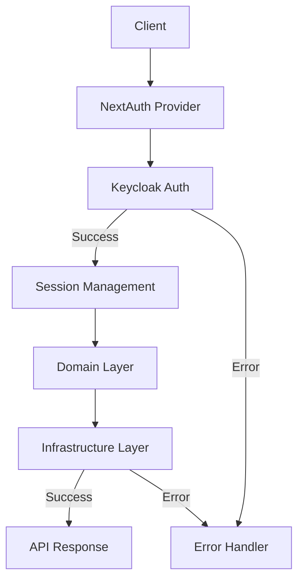

## Security Configuration Considerations
* Use HTTPS whenever possible
* Change default credentials
* Do not hard-code access credentials in project code
* Implement user input filters and remote object validations

## Exposed Ports
(Information about ports and services related to the application)

| Port | Client / Host / Processes | Server Type |
|------|---------------------------|-------------|
| 3000 | `frontend.port`           | Next.js Frontend |

## Logs
(Log examples in JSON format)

### EXAMPLE: Error Log
```json
{
  "timestamp": "2024-03-20T10:15:30Z",
  "level": "ERROR",
  "service": "multipay-admin",
  "traceId": "abc-123-xyz",
  "error": {
    "code": "AUTH_001",
    "message": "Invalid credentials",
    "details": {
      "username": "user@example.com",
      "reason": "Password mismatch"
    }
  },
  "context": {
    "ip": "192.168.1.100",
    "userAgent": "Mozilla/5.0...",
    "endpoint": "/api/v1/auth/login"
  }
}
```

### EXAMPLE: Success Log
```json
{
  "timestamp": "2024-03-20T10:15:30Z",
  "level": "INFO",
  "service": "multipay-admin",
  "traceId": "abc-123-xyz",
  "action": "USER_LOGIN",
  "status": "SUCCESS",
  "details": {
    "userId": "user-123",
    "username": "user@example.com",
    "loginMethod": "keycloak"
  },
  "context": {
    "ip": "192.168.1.100",
    "userAgent": "Mozilla/5.0...",
    "endpoint": "/api/v1/auth/login"
  }
}
```

## Authentication
The system uses NextAuth.js with Keycloak for authentication, implemented through the following components:

1. **NextAuthProvider**
   - Manages authentication via NextAuth.js
   - Keycloak integration
   - Session management
   - Route protection

2. **useKeycloakData Hook**
   - Access to authenticated user data
   - Role and permission management
   - Access validation

3. **useRoles Hook**
   - Role-based access control
   - Permission validation
   - Feature protection

## Data Flow Diagram



### Application Layers

1. **Presentation Layer**
   - Providers (NextAuth, ReactQuery, MUI Theme)
   - Contexts (Filter Context)
   - Hooks (useKeycloakData, useRoles, useOrders)

2. **Domain Layer**
   - Aggregates
   - SeedWork
   - Business Rules

3. **Infrastructure Layer**
   - Repositories
   - Context
   - Gateway
   - Services
   - Internal Services

### Authentication Flow

1. **Initial Request**
   - Client accesses application
   - NextAuth Provider intercepts
   - Redirect to Keycloak

2. **Authentication**
   - Keycloak validation
   - Token generation
   - Session creation

3. **Application Access**
   - Role validation
   - Access control
   - Route protection

4. **Error Handling**
   - Error logging
   - Redirection
   - Error messages

### Additional Security

1. **Route Protection**
   - Authentication middleware
   - Role validation
   - Access control

2. **State Management**
   - React Query for caching
   - Context API for global state
   - Secure persistence

3. **Data Validation**
   - Input filters
   - Data sanitization
   - Type validation

4. **Monitoring**
   - Action logging
   - Error tracking
   - Security metrics